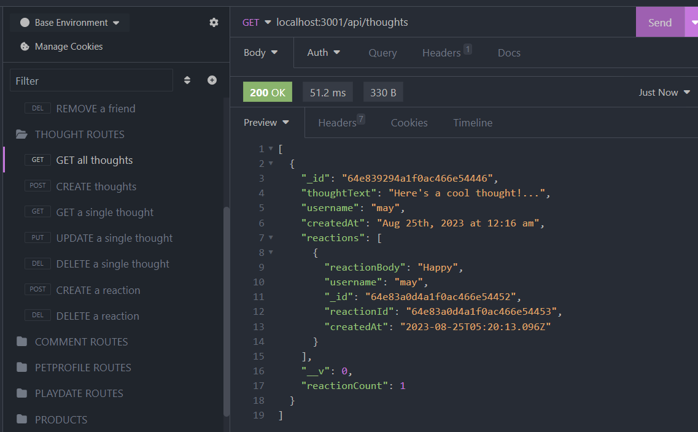
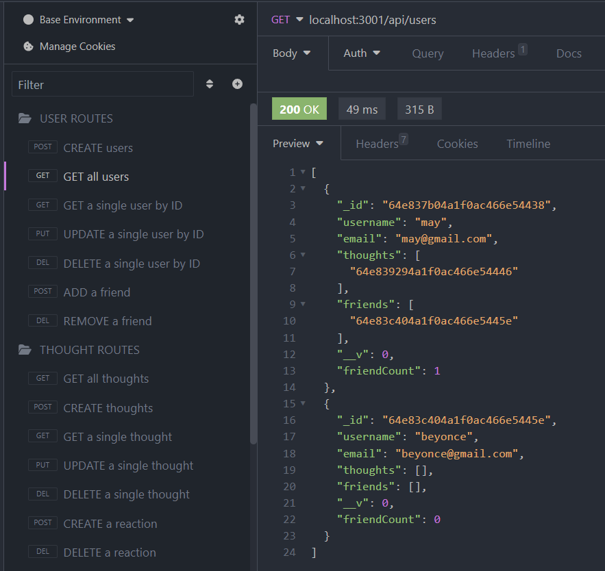

# Social-Network-API
UT's Fullstack Flex Web Development Bootcamp - Challenge 18

## Description
This activity focuses on building an API for a social network web app. MongoDB, known for speed with large data and flexibility, is used to run and test the database along with Insomnia to test the routes. Express.js and Mongoose are key tools in running this activity. The moment node package was also installed as well for the user and thought models to format the date. This application creates an API for a social network that uses NoSQL databases so that a website can handle large amounts of unstructured data. This application allows the user to activities such as sharing thoughts, reacting to friends' thoughts, updating and deleting users and friends, and managing friend lists. A walkthrough video demonstrating the app is attatched since the application is not deployed. 

The Mongoose models are synced to the MongoDB database and API GET routes in insomnia are used for user and thoughts. The data of each route is displayed in a formatted JSON and tests for API POST, PUT, and DELETE routes are successfully run.

## Usage

https://github.com/mayphamx/Social-Network-API
https://drive.google.com/file/d/1FPZanOKk7hXDmdBsw0xTUtbeop30WYnd/view 
